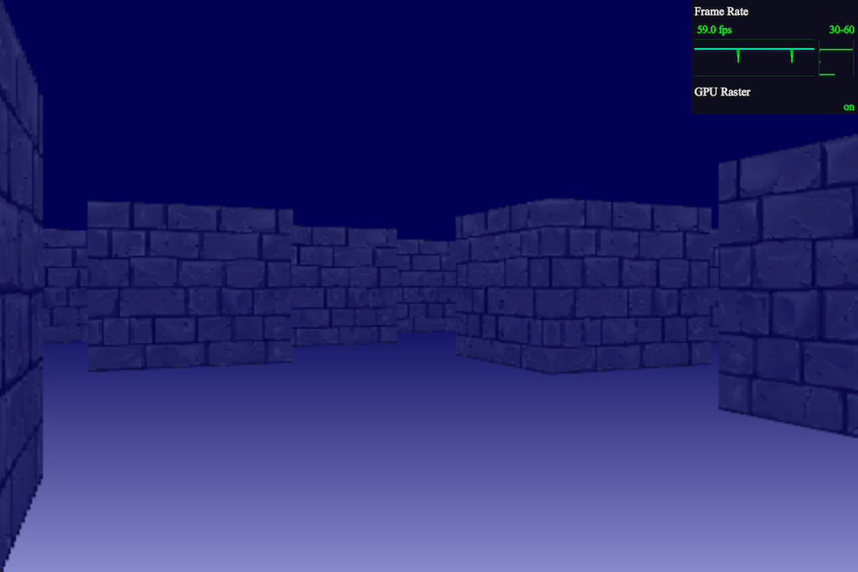

# Experiments with a raycasting rendering engine

Play on [https://antoine-richard.github.io/raycaster/](https://antoine-richard.github.io/raycaster/)

> Based on [Hunter Loftis' raycaster engine](http://www.playfuljs.com/a-first-person-engine-in-265-lines/)

